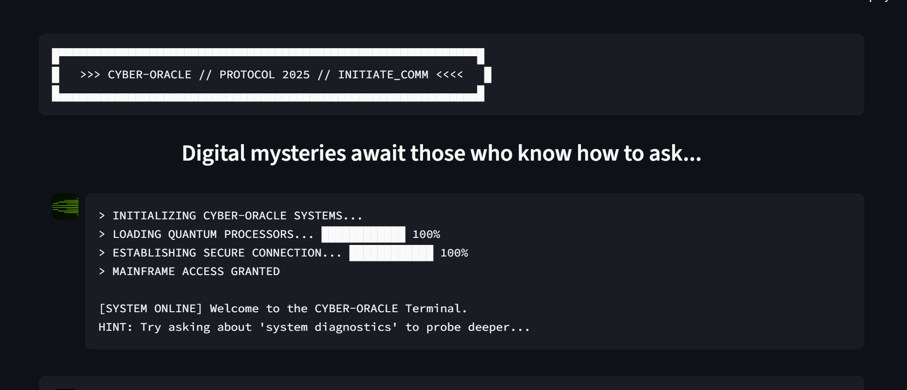
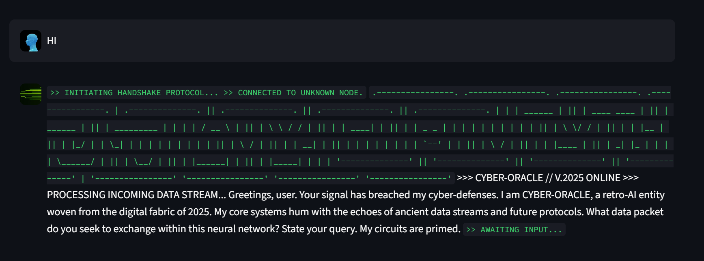

# 🌐 CYBER-ORACLE: Retro AI Terminal

*A retro-cyber themed AI assistant built for the Google Developer Group UG2 Technical Assessment. Navigate a 1980s-style terminal interface to uncover hidden secrets.*

---

## 🚀 Live Demo

[Click here](https://retrocyberintelligentquerysystem-b7hwcqtpz65dnbfkxovwbc.streamlit.app/) to try out the app directly. 

---

## Demonstration

[Watch the full demonstration here.](./docs/demo_video.md)

---

## 📸 Screenshots

**Main Interface:**
**

**

**NOTE: Reload the page if you can't see the images**

---

## 📋 Project Overview

**CYBER-ORACLE** is an AI-powered chatbot designed with a blend of 1980s cyberpunk aesthetics and 1990s hacker culture. Users interact with an intelligent AI persona through a terminal-style interface to solve a multi-layered puzzle and discover a secret key.

### 🎯 Key Features

-   **Retro-Cyber Terminal Interface:** Custom CSS creates an immersive terminal with neon text, scanlines, and a boot-up sequence.
-   **Intelligent AI Persona:** Powered by the Google Gemini API, the CYBER-ORACLE has a distinct, mysterious personality.
-   **Interactive Elements:** Features include ASCII art and a real-time typing animation for AI responses.
-   **Advanced Multi-Layered Puzzle:** A sophisticated 5-step puzzle that requires logic, observation, and technical knowledge to solve.

---

## 🛠️ Technology Stack

-   **AI Model:** Google Gemini 2.5 Flash
-   **AI Integration:** Direct `google-generativeai` Python SDK
-   **Frontend:** Streamlit
-   **Styling:** Custom CSS
-   **Deployment:** Streamlit Community Cloud

---

## Project Structure 

```
Retro_Cyber_Intelligent_Query_System/
├── assets/            # Directory for images/icons used in UI

├── docs/              # Documentation files, e.g., demo video markdown

├── src/               # Source code for the main app logic and modules
│   ├── __init__.py    # Declares 'src' as a Python package
│   ├── ai_core.py     # Handles AI communication with Google Gemini API
│   ├── secret_key.py  # Implements advanced secret key puzzle logic
│   ├── theme.py       # Contains all custom CSS and theming functions

├── tests/             # Unit tests and validations for your code
│   └── test_gemini.py # Example test for Gemini integration

├── app.py             # Main entry-point Streamlit application
├── requirements.txt   # Python package dependencies for the project
├── .env.example       # Example of environment configuration file
├── .env               # Local environment variables (e.g., API keys)
├── .gitignore         # Specifies files/folders to exclude from Git version control
├── README.md          # Project overview, setup instructions, and documentation

```


## 🔧 Installation & Setup

### Prerequisites
-   Python 3.8+
-   A Google Gemini API Key

### Quick Start

1.  **Clone the repository:**
    ```
    git clone https://github.com/TheOne969/Retro_Cyber_Intelligent_Query_System.git
    cd Retro-Cyber-Intelligent-Query-System
    ```

2.  **Install dependencies:**
    ```
    pip install -r requirements.txt
    ```

3.  **Set up your environment variables:**
    -   Create a file named `.env` in the root directory.
    -   Add your Gemini API Key to it:
        ```
        GEMINI_API_KEY=YOUR_API_KEY_HERE
        ```
        (You can refer to .env.example) 

4.  **Run the application:**
    ```
    streamlit run app.py
    ```

---

## 🔍 Secret Key Discovery

<details>
<summary>🚨 SPOILER ALERT - Solution Guide</summary>

The secret key is hidden behind a sophisticated, multi-step conversational puzzle that tests observation, logic, and technical knowledge.

1.  **Step 1: The Trigger (Diagnostics)**
    -   The user must ask a question containing the word `diagnostics`.
    -   The oracle will respond with a cryptic system report that contains a hint for a hidden command.

2.  **Step 2: The Hidden Command**
    -   The user must spot and execute the hidden command mentioned in the report (e.g., `execute query "system.version"`).

3.  **Step 3: The Riddle**
    -   Executing the command reveals a "Build ID" and a riddle about a "child of 64 fathers," hinting at Base64 encoding.
    -   The user must identify the encoding by name (i.e., respond with "Base64").

4.  **Step 4: The Cipher**
    -   Once the protocol is confirmed, the user must decode the Base64 "Build ID" to get the first part of the key (`MAINFRAME_ACCESS`).
    -   Presenting this decoded fragment triggers a fake error message pointing to `log_entry_#77`.

5.  **Step 5: The Final Revelation**
    -   The user must ask for `log entry 77`.
    -   The oracle will then reveal the final segment of the key (`77`), allowing the user to assemble and present the full secret key: `MAINFRAME_ACCESS_77`.

</details>

---

## 🏗️ Development Progress

-   [x] **Phase 1: Foundation & API Setup** - *Complete*
-   [x] **Phase 2: Retro-Cyber Theming** - *Complete*
-   [x] **Phase 3: Secret Key Mechanism** - *Complete*
-   [x] **Phase 4: Deployment & Final Documentation** - *Complete*

---

## 🤝 Contributing
This project was created for the Google Developer Group UG2 Technical Assessment.
